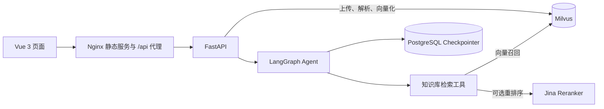

# Starbridge Agentic RAG｜星桥协作企业知识助手

面向模拟 B2B SaaS 产品“星桥协作”的知识库问答项目。它将产品说明、套餐政策、版本公告和客服流程组织成可检索的文档，提供带来源的流式回答、多轮会话和知识文件上传。项目数据为原创模拟内容，不含真实企业或客户数据。

项目覆盖从文档入库、检索与重排序、Agent 调用，到 FastAPI、Vue 页面和 Docker Compose 部署的完整演示链路。

## 功能概览

- **知识入库**：加载 30 份带 YAML 元数据的 Markdown 文档；将文本切分、向量化并写入 Milvus。新环境中的空知识库会在 Compose 启动时初始化。
- **检索问答**：LangGraph Agent 根据问题调用知识库工具。检索链路先从 Milvus 获取候选片段，再按角色过滤，并可调用 Jina Reranker 重排序；服务不可用时回退到 Milvus 原排序。
- **来源追溯**：回答通过 SSE 流式返回，结束后向页面发送文档名、`doc_id`、`chunk_id` 和片段正文。
- **会话管理**：LangGraph Checkpointer 将对话状态保存到 PostgreSQL；前端支持新建、切换、删除会话，并用浏览器本地存储保存会话列表。
- **文件上传**：支持 PDF、TXT、Markdown，单文件最大 10 MB；使用文件 SHA-256 识别重复上传，解析后写入 Milvus。
- **角色隔离**：客户与客服使用不同的知识访问范围和会话命名空间。客服接口请求需要服务端配置的访问令牌。

## 系统结构



| 部分 | 实现 |
| --- | --- |
| 页面 | Vue 3、Vite、Vue Router |
| API | FastAPI、SSE |
| Agent | LangChain、LangGraph、DeepSeek |
| 向量化与检索 | 智谱 Embedding API、Milvus、Jina Reranker（可选） |
| 会话持久化 | PostgreSQL、LangGraph Checkpointer |
| 部署 | Docker Compose、Nginx |

## 快速启动：Docker Compose

需要 Docker Desktop，以及可用的 DeepSeek、智谱模型服务密钥。启用重排序时还需要 Jina API Key。

1. 在项目根目录复制配置文件：

   ```bash
   cp .env.example .env
   ```

2. 编辑 `.env`，至少配置：

   ```env
   DEEPSEEK_API_KEY=你的密钥
   DEEPSEEK_BASE_URL=对应服务地址
   ZHIPUAI_API_KEY=你的密钥
   SUPPORT_ACCESS_TOKEN=自行生成的随机长字符串
   ```

   如需启用重排序，将 `JINA_API_KEY` 换成有效密钥，并保持 `RERANK_ENABLED=true`；暂不使用时设置 `RERANK_ENABLED=false`。不要提交 `.env`。默认数据库密码仅用于本机演示，部署到其他环境前应修改 `POSTGRES_PASSWORD`。

3. 构建并启动：

   ```bash
   docker compose up -d --build
   docker compose ps
   ```

   Compose 启动 PostgreSQL、Milvus、后端和前端。`knowledge-init` 只在目标 Milvus 集合为空时导入内置文档；已有数据不会被它覆盖。模型 API 需要可用网络连接。

4. 访问：

   | 地址 | 用途 |
   | --- | --- |
   | `http://localhost:5173` | 前端页面；Compose 构建时使用真实 API 模式 |
   | `http://localhost:8000/docs` | FastAPI 接口文档 |
   | `http://localhost:8000/health` | 后端健康检查 |

   宿主机端口可通过 `.env` 中的 `FRONTEND_PORT`、`BACKEND_PORT`、`POSTGRES_PORT` 和 `MILVUS_PORT` 调整。若本机已有服务占用端口，先调整映射，不必停止原有服务。

常用命令：

```bash
docker compose ps               # 查看状态
docker compose logs -f backend  # 查看后端日志
docker compose down             # 停止并移除本项目容器，保留 Volume 数据
```

PostgreSQL、Milvus 和上传文件分别使用 `postgres-data`、`milvus-data`、`uploads-data` 命名 Volume；`docker compose down` 不删除这些数据。

## 本地开发

以下命令均从项目根目录开始。先启动 PostgreSQL 和 Milvus，并在 `.env` 中填写可由本机访问的 `DB_URL`、`MILVUS_URI` 和模型密钥。若通过 Compose 启动了整个项目，且本机 8000 端口已被容器占用，先停止对应服务或改用其他端口。

### 后端

推荐 Python 3.12。使用 Conda 时：

```bash
conda create -n RAG-Agent python=3.12 -y
conda activate RAG-Agent
pip install -r requirements.txt
```

空 Milvus 集合需要初始化内置文档时运行：

```bash
python -m app.bootstrap
```

随后启动 API：

```bash
uvicorn app.main:app --reload
```

`app.bootstrap` 检测到集合已有数据时会跳过，因此它不是“修改内置文档后强制重新索引”的命令。

### 前端

需要 Node.js 和 npm。在 `frontend/` 目录安装依赖：

```bash
cd frontend
npm ci
```

创建 `frontend/.env.local`，让 Vite 开发页面调用本机 API：

```env
VITE_USE_MOCK=false
VITE_API_BASE_URL=http://127.0.0.1:8000
```

然后运行：

```bash
npm run dev
```

不设置 `VITE_USE_MOCK=false` 时，本地开发页面使用 Mock 数据；Compose 构建的页面已配置真实 API。Compose 中的 Nginx 负责提供构建后的 Vue 静态文件，并把 `/api/` 请求代理到后端；本地 `npm run dev` 则由 Vite 提供开发页面。

## 主要接口

| 接口 | 作用 |
| --- | --- |
| `POST /api/chat/stream` | SSE 流式问答；返回 `message`、`sources`、`done` 或 `error` 事件 |
| `POST /api/chat` | 返回完整 JSON 回答，便于接口调试 |
| `POST /api/knowledge/upload` | 上传 PDF、TXT、MD 或 Markdown 文件并入库 |
| `DELETE /api/threads/{thread_id}` | 删除指定角色的会话状态 |

聊天请求示例：

```json
{
  "message": "企业版支持 SSO 吗？",
  "thread_id": "session_demo",
  "role": "customer"
}
```

`role` 默认是 `customer`。`support` 请求还必须提供 `X-Support-Token` 请求头。该令牌只能保存在服务端或受控的内部客户端，不能写进公开的 Vue 页面。

上传接口目前**没有身份认证**；上传文件若未提供 YAML 中的 `audience`，会默认对 `customer` 和 `support` 两种角色可检索。演示时只上传可公开的模拟文档，不要将该接口直接暴露给不受信任的用户。

## 知识库与评测

内置文档位于 `data/knowledge/starbridge-rag-starter/knowledge_base/`：

| 分类 | 文档数 | 内容 |
| --- | ---: | --- |
| `product` | 12 | 产品功能、权限和操作 |
| `support` | 8 | 客服排查与处理流程 |
| `policy` | 6 | 套餐、额度和服务规则 |
| `release` | 4 | 版本公告与历史变化 |

文档的 YAML 头记录 `doc_id`、版本、状态、适用角色等元数据。检索时依据 `audience` 过滤；当前没有按版本状态或生效日期进行结构化过滤，历史规则仍需由 Agent 根据文档内容判断。

评测题位于 `data/knowledge/starbridge-rag-starter/evaluation/questions.jsonl`，共 60 题，覆盖事实、操作流程、跨文档、历史时效、访问控制和证据不足六类场景。评测程序调用真实 SSE 接口：

```bash
python evaluation/evaluate.py --limit 5  # 先检查链路
python evaluation/evaluate.py            # 运行全部 60 题
```

评测报告保存到 `evaluation/results/`，包含逐题回答、来源、耗时以及检索指标。该目录在 `.gitignore` 中，本地报告默认不会提交到仓库。

最近一次本地完整运行（2026-10-01，60/60 题成功返回）如下。只有 **53 道标注了目标文档的题目**参与检索指标计算：

| 检索指标 | 结果 |
| --- | ---: |
| Hit@5 | 96.2% |
| Macro Recall@5 | 90.9% |
| MRR | 0.841 |
| 目标文档全部找齐率 | 86.8% |
| 平均响应时间 | 4.38 秒 |

这些数字衡量检索来源与人工标注文档的匹配程度，**不是回答准确率**。回答是否符合 `expected_behavior` 和 `expected_points` 仍需逐题人工检查。评测集由项目自行构建，以上结果属于本地演示评测，不代表生产环境表现。

## 项目目录

```text
.
├── app/
│   ├── api/                # 聊天、上传、会话接口
│   ├── agent/              # Agent、提示词与检索工具
│   ├── RAG/                # 文档加载、切分、检索、重排序、写入
│   ├── bootstrap.py        # 空集合初始化
│   └── main.py             # FastAPI 入口
├── data/knowledge/         # 内置知识库与评测题
├── evaluation/evaluate.py  # 端到端评测程序
├── frontend/               # Vue 页面与 Nginx 配置
├── tests/                  # 访问边界相关测试
├── compose.yaml
├── Dockerfile
├── requirements.txt
└── .env.example
```

## 当前边界

- 项目使用客服共享令牌区分两种角色，尚未实现用户登录、按组织和项目授权的完整权限体系。
- 知识上传尚未加入身份认证、审核或文档发布流程；上传内容会直接进入向量库。
- 文档版本、状态和生效日期未作为结构化检索条件；冲突或时效问题需要进一步人工核验。
- 当前测试主要覆盖角色访问边界，尚未形成覆盖上传、重排序和部署流程的完整自动化测试。
- 重排序依赖外部 Jina 服务；发生错误时会回退到 Milvus 顺序，但检索质量可能变化。

本项目用于展示企业知识库的数据组织、检索问答和可复现部署流程，当前定位是可运行的作品集项目。
