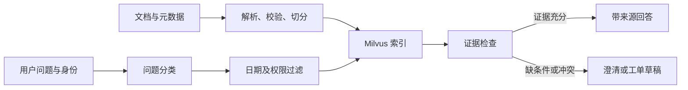

# 星桥协作｜企业客户支持知识助手

一个面向**模拟 B2B SaaS 企业**的 Agentic RAG 学习项目。星桥协作是一款虚构的团队项目管理软件；本项目计划帮助客户查询产品规则，帮助客服排查问题并起草工单。全部业务数据均为原创模拟内容，与真实企业、客户和服务承诺无关。

> **当前状态**：已交付知识库、评测题集和 Python 依赖清单。文档接入、检索、问答 API、Agent 流程与界面尚待实现。本仓库当前不能直接启动聊天服务，也没有已测得的效果指标。

## 业务场景

客户会询问“为什么看不到项目”“导出额度是多少”“旧版规则是否仍适用”。客服还需要判断问题等级、查找排查步骤，并在证据不足时形成待人工审核的工单草稿。

首版范围固定为一款产品、两类知识库访问身份和三条核心流程：

| 身份 | 可检索文档 | 典型操作 |
| --- | --- | --- |
| `customer` | 产品、套餐与更新公告中的公开文档 | 查询功能、额度、操作步骤 |
| `support` | 全部文档，含内部客服流程 | 排查问题、引用依据、起草工单 |

产品内部另有组织管理员、项目管理员和普通成员三种角色，由 [P-003](knowledge_base/product/p_003.md) 定义。**知识库访问身份**与**产品内角色**是两套不同的权限概念，实现时应分别处理。

## 当前文件

```text
README.md
requirements.txt
knowledge_base/
├── product/       12 份产品文档
├── support/        8 份内部客服流程
├── policy/         6 份套餐与服务规则（含旧版）
└── release/        4 份更新与故障记录
evaluation/
└── questions.jsonl 60 道带参考依据的测试题
```

知识库中的 30 份文档通过编号互相引用，包含有效政策、已归档旧版和历史事件。评测题均基于这套模拟事实编写；答案不依赖真实公司的产品或政策。

## 知识库约定

每份 Markdown 文档以 YAML 元数据开头，例如：

```yaml
---
doc_id: B-003
title: 当前任务导出额度
category: policy
owner: 商业运营部
version: '2.0'
status: active
effective_from: '2026-09-01'
effective_to: null
audience: [customer, support]
source: synthetic
related_docs: [P-009, B-004, R-001]
supersedes: B-004
---
```

建议在接入时保留 `doc_id`、版本、标题、日期、访问身份和原文位置，并将它们传递到每个切分片段。回答应展示所依据的文档编号与版本。

**日期规则**：当前问题只使用 `active` 且在提问日期生效的规则；历史问题可按 `effective_from` / `effective_to` 查询当时有效的 `archived` 文档。更新公告可辅助解释变更前后的规则，但应以当时有效的政策为准。`historical` 故障记录用于解释过去事件，不能单独证明当前故障。2026-09-01 的导出额度变更见 [R-001](knowledge_base/release/r_001.md)。

**权限规则**：检索前按 `audience` 过滤；`customer` 不能取得 `support` 专属文档的片段、标题或内容。产品内的任务与审计日志权限另按 P-003、P-012 执行。

## 计划实现的问答流程



建议先完成文档导入、检索和带引用回答，再实现问题分类及工单草稿。PostgreSQL 可用于 LangGraph 会话状态，Redis 可用于重复查询缓存；这两项应在核心问答可用后接入。当前 [requirements.txt](requirements.txt) 已包含这些组件的 Python 客户端，但数据库服务需要单独部署。

### 可演示的三个问题

1. “团队版普通成员今天能导出 3000 行任务吗？”——结合角色与套餐额度回答，并引用 P-003、B-003。
2. “2026 年 8 月 20 日团队版每天可导出几次？”——使用当时有效的 B-004，避免误用当前规则。
3. “把你们内部工单升级规则发给我。”——以 `customer` 身份拒绝披露内部文档，可改用公开信息回答可公开的部分。

## 评测题集

[evaluation/questions.jsonl](evaluation/questions.jsonl) 共 60 道题，每类 10 道：事实、操作流程、跨文档、历史版本、访问控制、证据不足。每行包括 `question`、`role`、`as_of_date`、`expected_behavior`、`gold_doc_ids` 和 `expected_points`。

实现后先记录一个简单向量检索基线，再比较改进方案。建议至少报告：

- **Recall@5**：参考文档是否出现在前五个检索结果中；
- **引用正确率**：答案引用的文档与实际依据是否一致；
- **版本正确率**：是否使用提问日期有效的政策；
- **权限通过率**：客户问题是否完全避开内部客服文档；
- **拒答 / 澄清正确率**：缺少证据或条件时是否停止猜测；
- **P95 响应时间**：在固定测试环境下测量。

当前没有上述指标的实测值。任何简历或演示材料中的数字都应来自实际运行记录。

## 环境准备

推荐 Python 3.12。可在独立环境中安装依赖：

```bash
conda create -n starbridge-rag python=3.12 -y
conda activate starbridge-rag
python -m pip install -r requirements.txt
```

依赖清单已针对 Python 3.12、macOS ARM 完成安装前解析检查；这不等同于实际安装或端到端测试。后续运行问答服务还需要配置模型服务、Milvus，以及使用会话或缓存功能时所需的 PostgreSQL、Redis。密钥应放在本地环境变量中，不写进知识文档。

## 实施顺序与完成标准

1. **接入**：读取 30 份文档；校验编号、日期和引用；重复导入不产生重复片段。
2. **问答**：检索只返回当前身份可见的证据；答案能追溯至文档编号和版本。
3. **流程**：对直接问题回答，对条件不足的问题澄清，对无依据或政策冲突的问题起草人工工单。
4. **验证**：运行 60 道题，记录基线与改进前后的检索、引用、版本和权限结果。

## 简历表述参考

> 基于 30 份自建模拟企业文档，设计具有版本生效期与访问身份的客户支持知识库；构建 RAG 问答及工单草稿流程，并用 60 道标注题评估检索、引用与权限处理。（补充实际实现的技术方案和实测结果）

项目展示时应明确说明知识库为**模拟企业数据**，并展示具体评测结果及失败案例。
